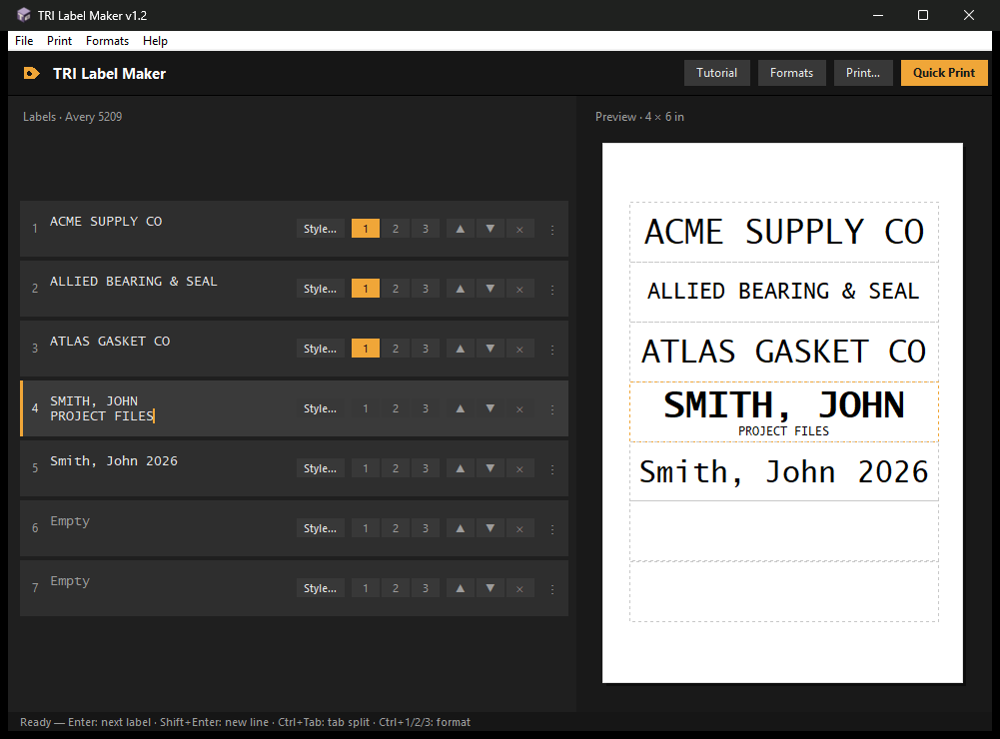

# label-maker-builder

A [Claude Code](https://claude.com/claude-code) skill that generates a
customized Windows label-printing desktop app, written in Python. The app
talks directly to the Windows printing system, so labels print at exact
size with no scaling and no print dialogs to click through.



The generated app prints Avery-style file-folder label sheets on 4x6 media
(or any sheet geometry you describe) with:

- a live WYSIWYG preview — what you see is exactly what prints
- per-label styling: font, per-line size (fixed or auto-fit), bold,
  alignment (including a tab left/right split), and three global format
  presets
- drag-and-drop label reordering
- zero-dialog **Quick Print** (paper size forced programmatically — the
  printer driver dialog is never opened)
- a printed alignment test + calibration dialog so output lands exactly on
  the labels
- auto-save, named label sets, and partial-sheet reuse

## Installing the skill

Copy this folder into your Claude Code skills directory:

- **Per project**: `<your project>\.claude\skills\label-maker-builder\`
- **All projects**: `%USERPROFILE%\.claude\skills\label-maker-builder\`

Then, in Claude Code, ask something like *"build me a label printing app"*
or invoke it directly with `/label-maker-builder`. The skill interviews you
(sheet geometry, app name, theme, default font, presets), verifies Python
and pywin32, then generates a complete project you own — with its own
CLAUDE.md so future Claude Code sessions understand it.

## Contents

- `SKILL.md` — the skill definition and generation instructions
- `reference/tri_label_maker.py` — the full working source of the origin
  app (TRI Label Maker) that generation adapts
- `reference/app_spec.md` — the functional spec the generated app must keep
- `reference/project_claude_md.md` — template for the generated project's
  CLAUDE.md

## Requirements (for the generated app)

> [!TIP]
> **You don't need to install any of this yourself.** When you run the
> skill, it checks for Python and pywin32 and offers to install whatever is
> missing. The list below just explains what those pieces are.

- **Windows** — the app prints by talking directly to Windows' own printing
  machinery, which doesn't exist on Mac or Linux.
- **Python 3.10 or newer** — the free programming language the app is
  written in. If you don't have it, get it from
  [python.org/downloads](https://www.python.org/downloads/) (during install,
  check the box that says *"Add Python to PATH"*).
- **The pywin32 add-on** — a free extension package that lets Python
  programs use Windows features such as printers. Python doesn't include it
  out of the box, so it's installed once with `pip`, Python's built-in
  package installer. To install it: open a command window (press the
  Windows key, type `cmd`, press Enter) and type:

  ```
  pip install pywin32
  ```

  `pip` downloads the package from the official Python package library and
  sets it up — that's the whole step. Without pywin32 the app still opens
  and you can design labels; only printing is unavailable.
